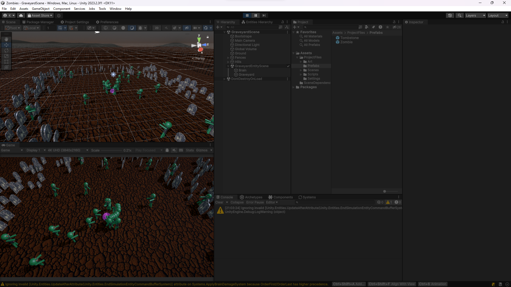
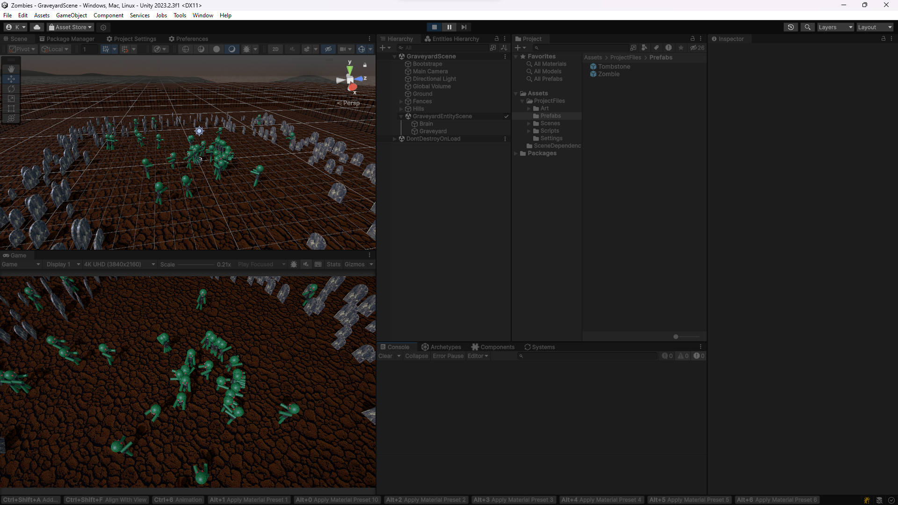

# Brain-eating zombies (Unity DOTS)

Eng | [Rus](resources/localization_readme/README_RU.md)

## Description

This is a learning project aimed at introducing a new approach to programming in Unity, ECS-DOTS. The project is created from the [instructional material](https://www.youtube.com/watch?v=IO6_6Y_YUdE).

## License

``` text
MIT License
```

## Screenshots




