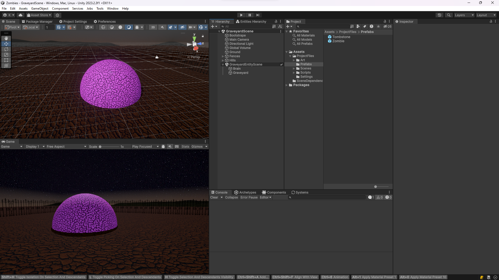
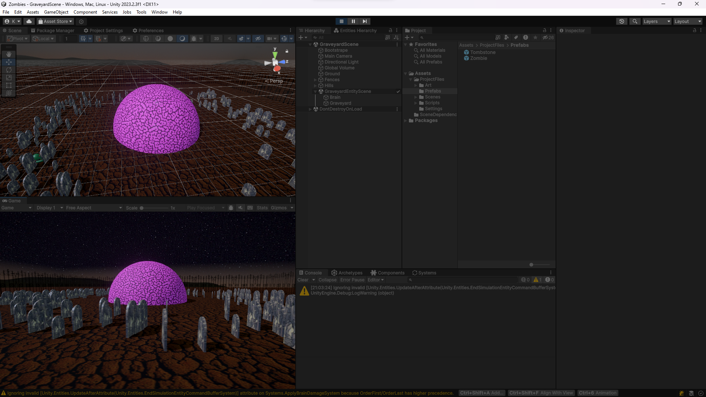
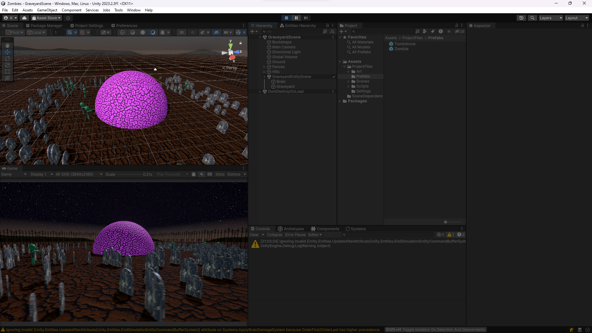
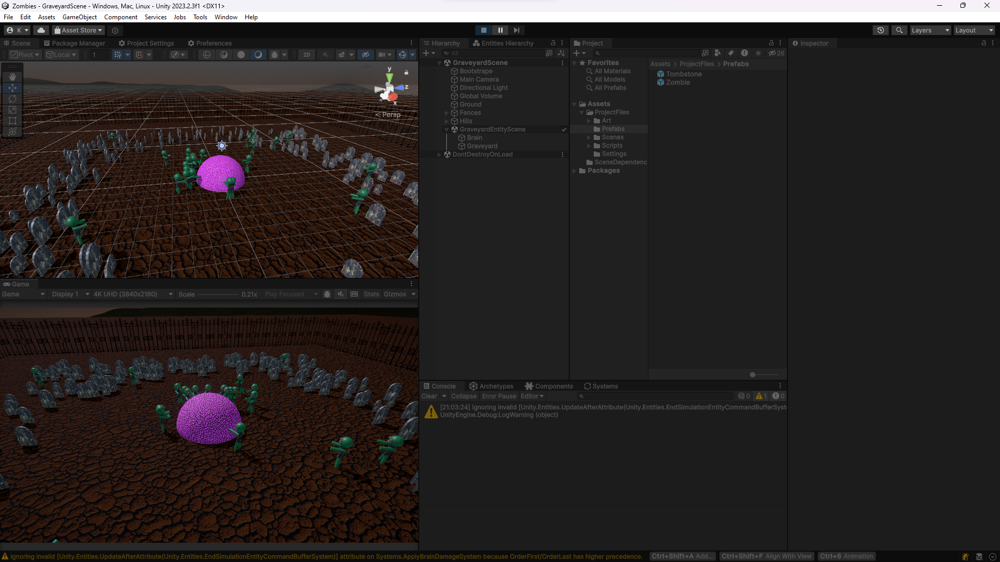
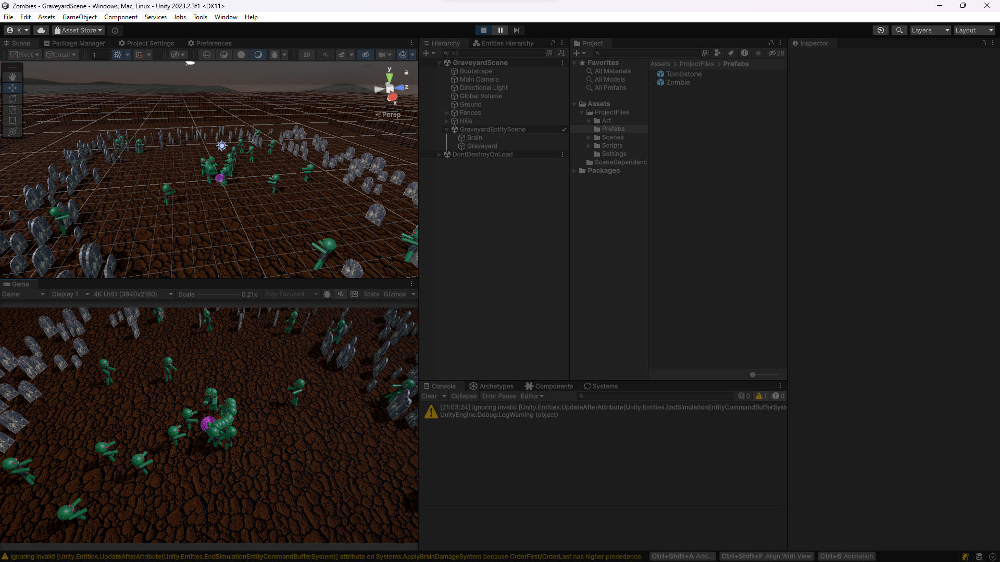
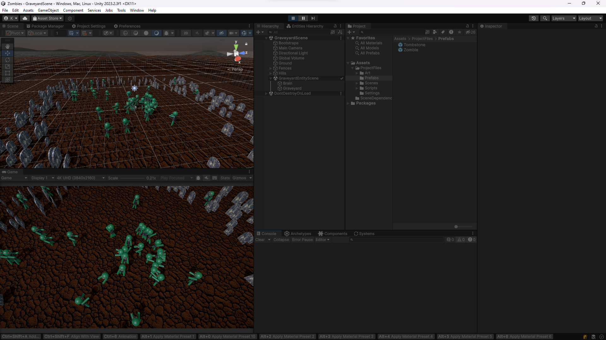

# Зомби, пожирающие мозг (Unity DOTS)

Rus | [Eng](../../README.md)

## Описание

Это учебный проект нацеленный на знакомство с новым подходом к программированию в Unity, ECS-DOTS. Проект создан по [учебному материалу](https://www.youtube.com/watch?v=IO6_6Y_YUdE).

## Лицензия

``` text
MIT License
```

## Скриншоты







